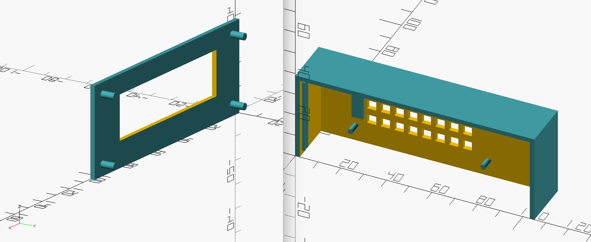

# 🚆 UK Train Departure Display

A little OLED departure board for your desk, hallway, or platform-obsessed home office. It shows real UK train times, calling points, delays and cancellations, styled like the dot-matrix boards you'd see at your local station — powered by a Raspberry Pi and the [Real Time Trains API](https://www.realtimetrains.co.uk/about/developer/).

No excuses for missing your train now. Well, unless it's cancelled. We'll tell you that too. 🙃


> **In a hurry?** Wire up the display, clone the repo, then run `./scripts/setup.sh`. It installs dependencies, walks you through `config.json` interactively, and can install the background service — and automatic updates — for you. It's safe to run again any time you want to change a setting. The steps below cover the same ground by hand, and are worth a skim regardless (especially [wiring](#1-wire-it-up) and [troubleshooting](#troubleshooting)).

  * [What you'll need](#what-youll-need)
  * [1. Wire it up](#1-wire-it-up)
  * [2. Install the software](#2-install-the-software)
  * [3. Get API access](#3-get-api-access)
  * [4. Configure your board](#4-configure-your-board)
  * [5. Take it for a test run](#5-take-it-for-a-test-run)
  * [6. Install it as a background service](#6-install-it-as-a-background-service)
  * [7. Keep it up to date automatically](#7-keep-it-up-to-date-automatically)
  * [Configuration reference](#configuration-reference)
  * [Running the desktop emulator](#running-the-desktop-emulator)
  * [Troubleshooting](#troubleshooting)
  * [3D printed case](#3d-printed-case)
  * [Credits](#credits)

<details open>
<summary><h2>What you'll need</h2></summary>

- A Raspberry Pi (any model with a 40-pin GPIO header and network access will do)
- A 256x64 SSD1322 (or compatible SSD13xx) OLED display
- Some jumper wires
- A [Real Time Trains API](https://api.rtt.io) account (free)
- 15 minutes and a mild enthusiasm for trains

</details>

<details open>
<summary><h2>1. Wire it up</h2></summary>

Connect your OLED display to the Pi's GPIO header over SPI.


If you're planning to make it look extra tidy, there's a [3D printed case](#3d-printed-case) further down.

Make sure SPI is enabled on your Pi:

```bash
sudo raspi-config
# Interface Options -> SPI -> Enable
```

</details>

<details open>
<summary><h2>2. Install the software</h2></summary>

SSH into your Pi (or grab a keyboard and monitor, we don't judge) and clone the repo:

```bash
git clone git@github.com:blighter/UK-Train-Departure-Display.git
cd UK-Train-Departure-Display
```

Check your Python version — you'll need 3.9+:

```bash
python3 --version
```

Raspberry Pi OS ships a recent Python 3 by default, so you're most likely already good to go. If you need a newer one, [here's a guide](https://gist.github.com/SeppPenner/6a5a30ebc8f79936fa136c524417761d) for installing an alternative version on Raspberry Pi OS, and [here's how to make `python3` point at it](https://linuxconfig.org/how-to-change-from-default-to-alternative-python-version-on-debian-linux).

> **On Raspberry Pi OS Lite**, you'll also need one extra system package before installing the Python dependencies:
> ```bash
> sudo apt-get install libopenjp2-7
> ```

Now install the Python dependencies:

```bash
pip3 install -r requirements.txt
```

> If `pip3` isn't a thing on your system, but `pip` is aliased to Python 3.6+, `pip` will do just fine.

</details>

<details open>
<summary><h2>3. Get API access</h2></summary>

Sign up for a free account at [api.rtt.io](https://api.rtt.io) — this gives you a username and password for the Real Time Trains API, which is what actually tells your board when the next train is departing (and whether it's running late, again).

</details>

<details open>
<summary><h2>4. Configure your board</h2></summary>

Copy the sample config and fill in your details:

```bash
cp config.sample.json config.json
```

At minimum, you need to set:

```javascript
{
  "journey": {
    "departureStation": "SVG",       // your station's CRS code
    "outOfHoursName": "Sevenoaks"    // shown on the blank screen outside operating hours
  },
  "rttApi": {
    "username": "your-rtt-username",
    "password": "your-rtt-password"
  }
}
```

Look up your station's short code (CRS) [on National Rail's site](https://www.nationalrail.co.uk/stations_destinations/48541.aspx). See the [configuration reference](#configuration-reference) below for every other option (destination filtering, refresh timing, dimming schedules, and so on).

</details>

<details open>
<summary><h2>5. Take it for a test run</h2></summary>

Before you commit to running this forever, give it a manual spin from the repo root:

```bash
./run.sh
```

This runs `src/main.py` with the flags for a real SSD1322 display wired over SPI. If your board bursts into life with today's departures, congratulations — you're now the proud operator of your own miniature station. All aboard! 🎉

If nothing appears, jump to [Troubleshooting](#troubleshooting).

Press `Ctrl+C` to stop it.

</details>

<details open>
<summary><h2>6. Install it as a background service</h2></summary>

Running it in your SSH session is great for testing, but the moment you close that terminal (or your connection drops on the platform edge of your WiFi signal), the display will die with it. To keep the board running permanently — surviving reboots, disconnects, and power blips — install it as a `systemd` service.

> `./scripts/setup.sh` does everything below for you (copying the repo into place and installing the unit file) — this is what to read if you'd rather do it by hand, or want to know what the script is doing.

This repo ships a ready-made unit file at `systemd/traindep.service`. It expects the code to live at `/var/local/UK-Train-Departure-Display`, so let's put it there:

```bash
sudo mkdir -p /var/local
sudo cp -r ~/UK-Train-Departure-Display /var/local/
```

(Adjust the source path if you cloned it somewhere other than your home directory.)

Now install and enable the service:

```bash
sudo cp /var/local/UK-Train-Departure-Display/systemd/traindep.service /etc/systemd/system/
sudo systemctl daemon-reload
sudo systemctl enable traindep.service
sudo systemctl start traindep.service
```

That's it — the display now runs in the background, restarts automatically if it crashes (`Restart=on-failure`), and comes back up on its own after a reboot. You can safely close your SSH session; the train doesn't stop just because the conductor's gone home. 🚂

Handy commands for managing it afterwards:

```bash
sudo systemctl status traindep.service    # is it running?
sudo systemctl stop traindep.service      # stop it
sudo systemctl restart traindep.service   # restart it (e.g. after editing config.json)
sudo journalctl -u traindep.service -f    # tail the logs live
```

> **Prefer not to use systemd?** A quick-and-dirty alternative is `nohup`, which detaches the process from your terminal session:
> ```bash
> nohup ./run.sh > traindep.log 2>&1 &
> ```
> This survives you logging out, but won't restart on crash or reboot — `systemd` is the recommended route for anything left running unattended.

</details>

<details open>
<summary><h2>7. Keep it up to date automatically</h2></summary>

Once it's tucked away behind a display, you're not going to SSH in and `git pull` every time there's a fix. `scripts/update.sh` does that for you: it fetches `origin`, fast-forwards the checkout at `/var/local/UK-Train-Departure-Display` if there's anything new, reinstalls `requirements.txt` if that changed, and restarts `traindep.service` so the new code takes effect — all without ever merging or force-pushing.

It refuses to touch anything if the checkout has local edits (so hand-editing on the Pi is safe) or if history has diverged from `origin` (so it never overwrites work with a forced push). If a post-update dependency install fails, it rolls the checkout back to the previous commit rather than leaving the service on code it can't run.

Wire it up to run on a timer:

```bash
sudo cp /var/local/UK-Train-Departure-Display/systemd/traindep-update.service /etc/systemd/system/
sudo cp /var/local/UK-Train-Departure-Display/systemd/traindep-update.timer /etc/systemd/system/
sudo systemctl daemon-reload
sudo systemctl enable --now traindep-update.timer
```

That checks for updates 5 minutes after boot and every 30 minutes after that (edit `OnUnitActiveSec` in the timer unit to change the interval). Handy commands:

```bash
sudo systemctl start traindep-update.service    # check for an update right now
sudo journalctl -u traindep-update.service -f   # see what the last check did
sudo systemctl list-timers traindep-update.timer  # when it'll next run
```

Pushing a new commit to `origin` is now all it takes to roll it out to every board running this.

</details>

<details>
<summary><h2>Configuration reference</h2></summary>

### General settings

| Key | Description |
|---|---|
| `refreshTime` | How often (in seconds) the board asks the API for new data. Each refresh costs up to two API calls. |

### Journey settings (`journey`)

| Key | Description |
|---|---|
| `departureStation` | The [CRS code](https://www.nationalrail.co.uk/stations_destinations/48541.aspx) for your station. |
| `destinationStation` | Optional CRS code to only show trains heading towards a particular destination. |
| `outOfHoursName` | The text shown on the blank "Welcome to..." screen outside operating hours, or when there are no services running. Required. |
| `stationAbbr` | A map of words to abbreviations, used to shorten long station names so they fit on a small screen, e.g. `{ "International": "Intl." }`. |

### Real Time Trains API settings (`rttApi`) — used by default

| Key | Description |
|---|---|
| `username` | Your Real Time Trains username. |
| `password` | Your Real Time Trains password. |
| `operatingHours` | The hour range (e.g. `"6-23"`) during which the board actively requests train times. The free tier allows 1000 calls a day. |

### Transport API settings (`transportApi`) — legacy, avoid

Kept for backwards compatibility. Transport API's free tier now allows just 30 calls a day, which isn't enough to run this in any meaningful way — you'd need a commercial agreement. Stick with `rttApi` unless you have a good reason not to.

### Choosing the API (`apiMethod`)

Set to `"rtt"` (the default) to use Real Time Trains, or `"transport"` to fall back to the legacy Transport API.

### Reliability settings (optional)

| Key | Description |
|---|---|
| `retryBackoffSeconds` | If a refresh fails (network blip, API hiccup), the board keeps showing the last good data and retries after these delays in turn — e.g. `[10, 30, 60]` retries after 10s, then 30s, then 60s. Once exhausted, it falls back to trying again every `refreshTime` seconds. Defaults to `[10, 30, 60]`. |
| `staleAfterSeconds` | If no refresh has succeeded for this long, a small `!` appears next to the clock so you know you're looking at old data rather than live times. Defaults to `refreshTime * 2`. |

### Display settings (optional)

`display.dimming` dims the panel outside chosen hours — handy if it lives in a bedroom or hallway — independently of `operatingHours`:

```javascript
"display": {
  "dimming": {
    "enabled": false,
    "startHour": 22,
    "endHour": 6,
    "brightness": 10,
    "normalBrightness": 255
  }
}
```

| Key | Description |
|---|---|
| `enabled` | Turns the dimming schedule on/off. |
| `startHour` / `endHour` | The hour range (0-23) during which the panel dims. Wraps midnight, so `22` to `6` dims overnight. |
| `brightness` | Contrast level (0-255) used during the dim window. |
| `normalBrightness` | Contrast level (0-255) used outside the dim window. Defaults to `255`. |

Not every display backend supports hardware contrast control (e.g. the desktop emulator) — on those, dimming is silently a no-op.

`display.splash` shows a one-off startup screen — credit, a link back to this repo, and a QR code for it — before the board starts fetching departures. It's on by default; set `enabled` to `false` to skip it:

```javascript
"display": {
  "splash": {
    "enabled": true,
    "durationSeconds": 5,
    "message": "Created by blighter",
    "url": "https://github.com/blighter/UK-Train-Departure-Display",
    "showQrCode": true
  }
}
```

| Key | Description |
|---|---|
| `enabled` | Shows the splash screen on startup. Defaults to `true`. |
| `durationSeconds` | How long the splash screen stays up before the board moves on to departures. Defaults to `5`. |
| `message` | The headline text. Defaults to `"Created by blighter"`. |
| `url` | The link shown as text and, if `showQrCode` is on, encoded as a QR code. |
| `showQrCode` | Draws a QR code for `url` next to the text. Defaults to `true`. |

The panel is only 64px tall, so the QR code is small (real-world size depends on your panel's physical dimensions) — get the phone camera close. If a longer/custom `url` needs a QR code too big to fit, the splash screen quietly falls back to text-only rather than show a cropped, unscannable one.

</details>

<details>
<summary><h2>Running the desktop emulator</h2></summary>

Don't have a Pi or a screen handy? You can preview the board on your own machine without any hardware, using `luma.emulator`.

> `pygame` may not have a prebuilt wheel for the very latest Python release yet, in which case `pip` builds it from source. That requires SDL2's dev headers (plus `SDL2_image`/`SDL2_ttf`/`SDL2_mixer` for the emulator's on-screen assets to load) — e.g. on macOS: `brew install sdl2 sdl2_image sdl2_mixer sdl2_ttf`. Without them, the build still succeeds but silently lacks PNG support, which breaks the emulator window (`pygame.error: File is not a Windows BMP file`). This only affects the desktop emulator — real hardware over SPI doesn't use `pygame` at all.

```bash
python3 ./src/main.py --display pygame --width 256 --height 64
```

Or write frames out to image files instead of opening a window:

```bash
python3 ./src/main.py --display capture --width 256 --height 64
```

A full list of `--display` options lives in the [luma.examples README](https://github.com/rm-hull/luma.examples). Pass `--interface spi` when talking to real hardware over SPI (the default interface is `i2c`).

Note that all of these commands must be run from the repo root, since `config.json` is opened by relative path.

</details>

<details>
<summary><h2>Troubleshooting</h2></summary>

- **Nothing appears on screen** — double check your wiring against the pinout diagrams above, and confirm SPI is enabled (`sudo raspi-config`).
- **`Please ensure the 'outOfHoursName' environment variable is set`** — despite the wording, this means `journey.outOfHoursName` is missing from `config.json`. Set it to whatever text you'd like shown outside operating hours.
- **The board just stops after a while** — check `sudo journalctl -u traindep.service -f` if running as a service, or your terminal output otherwise. A handful of failed refreshes are tolerated and retried automatically; a persistent API or network failure will eventually surface an error.
- **Emulator window won't open / BMP errors** — see the SDL2 note under [Running the desktop emulator](#running-the-desktop-emulator).

</details>

<details>
<summary><h2>3D printed case</h2></summary>

Fancy housing your board properly? `3d-printed-case/` has the OpenSCAD source and ready-to-print STL files for a case.



</details>

<details>
<summary><h2>Credits</h2></summary>

This project was originally built by [Chris Hutchinson](https://github.com/chrishutchinson/) — [he posted a video demo](https://twitter.com/chrishutchinson/status/1136743837244768257) of it running on real hardware, well worth a watch.

The move to the Real Time Trains API, and the reliability/display improvements it's built on, came from [ghostseven](https://github.com/ghostseven/UK-Train-Departure-Display).

The dot-matrix fonts are the work of [`DanielHartUK`](https://github.com/DanielHartUK/Dot-Matrix-Typeface) — thank you for making that resource available!

### Example: out of hours / no services


</details>

Enjoy your new departure board — may your trains always be "On time" and never "Cancelled". 🚉
